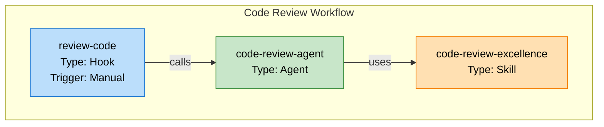

# Document-AI Skill

**Version**: 2.0.0  
**Purpose**: Discover all AI tools (skills, hooks, agents) in your project and generate comprehensive automation documentation with visualization  
**Platform Support**: Kiro, Claude  
**Status**: ✅ Ready for Production

---

## Overview

The **document-ai** skill is your automation infrastructure documentation engine. It discovers all skills, hooks, and agents in your project and generates a comprehensive **AI.md** file that includes:

1. **AI Tools Inventory** — All skills organized by type (Custom, Open-source, Agent Skill)
2. **Dynamic Decision Trees** — Smart workflows based on what skills actually exist
3. **Agent Tools Graph** — Mermaid diagram showing Hook → Agent → Skill relationships

The skill keeps your automation documentation **always current** by completely regenerating it from scratch each time you run it.

---

## Table of Contents

- [Quick Start](#quick-start)
- [What This Skill Does](#what-this-skill-does)
- [When to Use](#when-to-use)
- [How to Use](#how-to-use)
- [Understanding the Graph](#understanding-the-graph)
- [Design Principles](#design-principles)
- [Platform Selection](#platform-selection)
- [Common Questions](#common-questions)
- [Troubleshooting](#troubleshooting)
- [Technical Architecture](#technical-architecture)
- [Implementation Details](#implementation-details)
- [Integration Points](#integration-points)
- [Files & Configuration](#files--configuration)
- [Success Criteria](#success-criteria)
- [Examples](#examples)
- [Advanced Usage](#advanced-usage)
- [Version History](#version-history)
- [Getting Help](#getting-help)

---

## What This Skill Does

### 1. AI Tools Discovery & Inventory

**Classification Rules (Source of Truth):**

The classification is determined by ONE authoritative source — `skills-lock.json`:

| Category | Rule | Example |
|----------|------|---------|
| **Open-source** | Skill name exists as a key in `skills-lock.json` | `karpathy-guidelines`, `code-review-excellence`, `r3f-*`, `threejs-*`, `skill-creator` |
| **Custom** | Skill has a local SKILL.md but is NOT in `skills-lock.json` | `align-product-config-validator`, `document-ai`, `server-dev`, `server-test`, `r3f-pbr`, `r3f-contact-shadows`, `r3f-html` |
| **Agent Skill** | Skill comes from an enabled plugin in `.claude/settings.json` | `spec`, `plan`, `build` (from addyosmani/agent-skills) |

**Key insight**: Many open-source skills have local copies in `.kiro/skills/` (they are installed from GitHub). The local directory does NOT make them custom. Only `skills-lock.json` determines open-source status.

**Discovery order:**
1. Parse `skills-lock.json` FIRST → collect all open-source skill names
2. Scan `.kiro/skills/` and `.claude/skills/` → only skills NOT in step 1 are custom
3. Check `.claude/settings.json` → enabled plugins provide agent skills

**Discovers from:**
- Open-source skills: `skills-lock.json` (keys of the `skills` object)
- Custom skills: `.kiro/skills/<name>/SKILL.md` and `.claude/skills/<name>/SKILL.md` (excluding names found in `skills-lock.json`)
- Agent skills: `.claude/settings.json` enabled plugins

**Generates:**
- Organized tables with: Skill | Type | Description | Source
- Proper attribution links to original repositories (for open-source)
- Local file paths (for custom)
- Alphabetical sorting within each category
- Custom Skills, Open-source Skills, and Agent Skills sections

### 2. Dynamic Decision Trees

**Creates context-aware workflows** based on discovered skills:
- Identifies available skill types (review, testing, docs, graphics, utilities)
- Creates decision tree for: "When should I use X skill?"
- Only mentions skills that **actually exist** in your project
- Updates automatically when you add/remove skills

**Example:**
```
Need to review code?
├─ YES → Use code-review-excellence
└─ NO → Use karpathy-guidelines for writing
```

### 3. Agent Tools Graph (NEW)

**Platform-aware discovery** discovers automation relationships:

**For Kiro platform:**
- Scans `.kiro/hooks/*.kiro.hook` files (JSON format)
  - Extracts: hook name, trigger type, agent invocations
  - Pattern: `invokeSubAgent(name: "agent-name", ...)`
  - Creates Hook → Agent relationships

- Scans `.kiro/agents/*.agent.json` files (JSON format)
  - Extracts: agent name, description, skills array
  - Creates Agent → Skill relationships

**For Claude platform:**
- Similar discovery from `.claude/hooks/` and `.claude/agents/` (if they exist)
- Adapts to platform-specific configuration format

**Generates Mermaid diagram** with:
- **Color-coded nodes**: Blue (hooks) | Green (agents) | Orange (skills)
- **Rich annotations**: Name, type, description, trigger type, skill type
- **Edge labels**: "calls", "triggers", "uses" show relationship types
- **Workflow clustering**: Groups related entities (e.g., "Code Review Workflow")
- **Isolated entities**: Shows unconnected hooks/agents/skills (useful for cleanup)
- **Top-to-bottom layout**: Standard workflow visualization

### 4. Deduplication & Cleanup

- `skills-lock.json` is the SOLE source of truth for open-source classification
- If a skill name is in `skills-lock.json`, it is ALWAYS "Open-source" — even if it has a local copy in `.kiro/skills/`
- Each skill appears exactly once (no duplicates across sections)
- No redundant references
- Clean, non-redundant inventory

---

## When to Use

- **After adding new skills** — Update AI.md with new discoveries
- **After adding hooks or agents** — Visualize new automation workflows
- **Before releases** — Verify documentation is current and accurate
- **During audits** — Understand complete automation infrastructure
- **Onboarding new team members** — Generate reference docs showing all available tools
- **Troubleshooting workflows** — Visualize hook→agent→skill chains to debug issues
- **Architecture review** — See automation dependencies at a glance

**Important**: AI.md is **completely regenerated from scratch**. No stale data persists.

---

## How to Use

### Quick Start

**Option 1: Use the hook (Kiro)**
```
Manually trigger the "Document AI" hook in your IDE
```

**Option 2: Ask the skill directly**
```
"Generate comprehensive AI.md for Kiro platform"
```

### What Happens

1. **Platform Selection**: You're asked "Which platform? (Kiro or Claude)"
2. **Discovery**: Skill scans project for hooks, agents, skills
3. **Graph Building**: Constructs relationship graph from discovered entities
4. **Generation**: Creates AI.md with all sections
5. **Output**: Updated `/AI.md` in project root

### Sample AI.md Structure

```markdown
# Available Skills

## Custom Skills
| Skill | Type | Description | Keywords |
| ... |

## Open-source Skills
| Skill | Type | Source | Keywords |
| ... |

## Agent Skills
| Skill | Type | Agent | Description |
| ... |

## 🎯 Decision Trees

[Dynamic workflows based on discovered skills]

## 🔗 Agent Tools Graph

[Mermaid diagram showing automation infrastructure]

### Graph Legend
- 🪝 Hook (Blue) — Triggers automation
- 🤖 Agent (Green) — Executes tasks
- 💡 Skill (Orange) — Provides capabilities


```

---

## Understanding the Graph

### Node Types & Colors

| Node | Color | Meaning |
|------|-------|---------|
| 🪝 Hook | Blue | Triggers automation (manual, file event, task completion) |
| 🤖 Agent | Green | Executes workflows using skills |
| 💡 Skill | Orange | Provides specialized capabilities |

### Edge Types

| Edge Label | Meaning |
|-----------|---------|
| "calls" | Hook invokes Agent (usually manual trigger) |
| "triggers" | Hook event triggers Agent (file change, task completion) |
| "uses" | Agent uses Skill (agent depends on skill) |

### Simple Example

```
review-code (Hook)
    ↓ calls
code-review-agent (Agent)
    ↓ uses
code-review-excellence (Skill)
```

### Complex Example

```
                      ┌─ code-review-agent ─→ code-review-excellence
review-code hook ─────┤
                      └─ lint-agent ─→ linting-excellence

post-task-review ────→ post-task-code-review-agent ─→ code-review-excellence
```

### Isolated Entities

Nodes not connected to workflows:
```
[unused-hook] ○           [unused-agent] ○           [unused-skill] ○
```

These are good candidates for cleanup or future use.

---

## Design Principles

### Generic & Project-Agnostic

✅ **ALLOWED**:
- Generic file paths (`.kiro/`, `.claude/`, `skills-lock.json`)
- Dynamic generation based on discovered entities
- Platform-specific logic (user chooses Kiro or Claude)

❌ **FORBIDDEN**:
- Hardcoded skill/hook/agent names
- Project-specific tool references
- Hidden platform assumptions

**Why?** This skill works identically for **ANY project** across **ANY platforms**.

### Key Design Axioms

1. **Direct references only** — No implicit skill inference, only explicit names
2. **Include all entities** — Show connected AND isolated nodes
3. **Validate relationships** — Verify skill/agent references exist before linking
4. **Handle errors gracefully** — Skip malformed JSON, log warnings, continue
5. **No hardcoding** — All relationships discovered dynamically
6. **Platform-aware** — Always ask which platform to document
7. **Backward compatible** — Existing functionality untouched
8. **Never stale** — Complete regeneration each time

---

## Platform Selection

When you run this skill, it asks:

```
Which platform should I document? (Kiro or Claude)
```

### Kiro Platform
- Scans: `.kiro/hooks/`, `.kiro/agents/`, `.kiro/skills/`
- Discovers: All Kiro-based automation infrastructure
- Generates: Comprehensive graph of Kiro automation

### Claude Platform
- Scans: `.claude/hooks/`, `.claude/agents/`, `.claude/skills/` (if structured)
- Discovers: Claude-based automation infrastructure
- Generates: Comprehensive graph of Claude automation

---

## Common Questions

### Q: Why do I see isolated nodes in the graph?
**A:** They're automation components not yet connected to workflows. You can clean them up or use them in future workflows.

### Q: What if my hook doesn't appear?
**A:** Verify:
1. File exists: `.kiro/hooks/your-hook.kiro.hook`
2. JSON is valid (no syntax errors)
3. File has `"then": { "type": "askAgent", "prompt": "..." }`
4. Check console output for warnings

### Q: Why isn't my agent showing skills?
**A:** Verify:
1. Agent JSON has: `"skills": ["skill-name"]`
2. Skill names match exactly (case-sensitive)
3. Skills actually exist in `.kiro/skills/` or `skills-lock.json`

### Q: Can I manually edit the graph in AI.md?
**A:** No, it's auto-generated. To change automation:
1. Modify `.kiro/hooks/` or `.kiro/agents/`
2. Add/remove skills from `skills-lock.json`
3. Re-run this skill to regenerate

### Q: Does this break if I have broken references?
**A:** No. The skill logs warnings about broken references but continues. You'll see warnings in the output.

### Q: How long does it take?
**A:** Very fast for typical projects (< 1 second discovery + < 2 seconds Mermaid generation).

### Q: For large projects with hundreds of hooks/agents?
**A:** Still scales well. Graph is linear complexity. Mermaid rendering might take a few seconds to display, but generation is instant.

---

## Troubleshooting

### Graph Not Generated
1. Check `.kiro/hooks/` and `.kiro/agents/` directories exist
2. Verify hook JSON files have valid syntax
3. Ensure hooks have `"then.prompt"` with `invokeSubAgent()` calls
4. Look for warnings in console output

### Graph Shows No Relationships
1. Hooks may not reference agents in prompts
2. Agents may not have `"skills"` array defined
3. Verify agent JSON structure is correct

### AI.md Not Created
1. Check project root is writable
2. Verify you have read permissions on `.kiro/` directories
3. Check for special characters in file paths

### Performance Issues
- For typical projects: Should be instant
- For very large projects: Consider running in off-peak times
- Graph generation is always linear, never exponential

---

## Implementation Details

### Discovery Process

**Step 1: Open-Source Skills Discovery (FIRST — establishes baseline)**
- Parse `skills-lock.json` at project root
- Every key in the `skills` object is an open-source skill name
- Collect ALL names into an "open-source names" set
- Extract `source` field for GitHub attribution links
- This step MUST happen before custom skill discovery

**Step 2: Custom Skills Discovery (EXCLUDES open-source)**
- Scan `.kiro/skills/*/SKILL.md` and `.claude/skills/*/SKILL.md`
- For each skill directory with a SKILL.md:
  - Extract name from YAML frontmatter
  - Check if name is in the "open-source names" set from Step 1
  - If name IS in open-source set → SKIP (already classified)
  - If name is NOT in open-source set → classify as Custom
- This ensures no skill appears in both Custom and Open-source

**Step 3: Agent Skills Discovery**
- Check `.claude/settings.json` for `enabledPlugins`
- Only include if plugin is explicitly enabled
- These are separate from local skill directories

**Step 4: Hook Discovery**
- Scans `.kiro/hooks/*.kiro.hook` files
- Extracts: name, trigger type, agent invocations
- Uses regex to find: `invokeSubAgent(name: "agent-name")`
- Creates Hook → Agent relationships

**Step 5: Agent Discovery**
- Scans `.kiro/agents/*.agent.json` files
- Extracts: name, displayName, description, skills array
- Creates Agent → Skill relationships

**Step 6: Graph Building**
- Creates nodes for all hooks, agents, skills
- Creates edges based on discovered relationships
- Validates relationships exist before linking
- Identifies workflows by name prefix grouping

**Step 7: Mermaid Generation**
- Converts graph to Mermaid TD syntax
- Applies color styling (blue/green/orange)
- Formats rich node labels (name, type, description)
- Generates sub-graphs for workflow clustering
- Includes isolated nodes

**Step 8: AI.md Generation**
- Writes all sections (skills tables, decision trees, graph)
- Complete regeneration each time (no stale data)

### Error Handling

The skill handles edge cases gracefully:
- **Malformed JSON**: Logs warning, skips file, continues
- **Broken references**: Documented as warnings, graph continues
- **Missing directories**: Creates empty sections with notes
- **Circular dependencies**: Detected and visualized appropriately
- **Empty project**: Generates empty sections with explanatory text

---

## Integration Points

This skill works alongside:
- **skill-creator** — Create and improve skills (newly created skills appear in inventory)
- **code-review-excellence** — Discovered and visualized in graph
- **Any custom skills** — Automatically included in documentation

---

## Files

### Input Files (Scanned, Not Modified)
- `.kiro/hooks/*.kiro.hook` — Hook definitions with triggers
- `.kiro/agents/*.agent.json` — Agent definitions with skills
- `.kiro/skills/*/SKILL.md` — Skill metadata
- `skills-lock.json` — Open-source skill references
- `.claude/settings.json` — Claude platform config

### Output File (Generated)
- `/AI.md` — Complete automation documentation (completely regenerated)

### Documentation Files (This Skill)
- `SKILL.md` — Feature specification and technical reference
- `README.md` — This file, comprehensive user guide

---

## Success Criteria

✅ AI.md generated with all sections
✅ Skills inventory accurate and complete
✅ Decision trees dynamic and based on discovered skills
✅ Agent Tools Graph generated and embedded
✅ Graph shows all hook→agent→skill relationships
✅ Graph includes isolated nodes (unconnected entities)
✅ Mermaid syntax valid and renders correctly
✅ Rich node annotations present (name, type, description, trigger type)
✅ Edge labels clarify relationship types ("calls", "triggers", "uses")
✅ Sub-graphs cluster related workflows
✅ Both Kiro and Claude platforms supported
✅ Error handling for malformed files
✅ No stale data in output
✅ Complete regeneration from scratch each time

---

## Examples

### Example 1: Code Review Workflow
```
review-code (Manual Hook)
    ├─ calls → code-review-agent
    │           └─ uses → code-review-excellence
    └─ calls → lint-agent
                └─ uses → eslint-formatter

post-task-review (Task Completion Hook)
    └─ triggers → post-task-code-review-agent
                   └─ uses → code-review-excellence
```

### Example 2: Isolated Skills
```
[code-review-excellence] ○ — Used by agents
[karpathy-guidelines] ○ — Used by agents
[document-ai] ○ — Available but not used by agents
[server-dev] ○ — Available but not used by agents
```

### Example 3: Complex Infrastructure
```
file-changed hook ────→ auto-formatter agent ──→ prettier
                        ├──→ eslint-fixer
                        └──→ prettier-config

manual-trigger hook ──→ code-review agent ───→ code-review-excellence
                        ├──→ karpathy-guidelines
                        └──→ security-analyzer

task-completed hook ──→ post-review agent ───→ code-review-excellence
```

---

## Frequently Used Patterns

### When to Use Which Skill
```
Need code review?
├─ Existing PR/code → code-review-excellence
└─ Writing new code → karpathy-guidelines

Need 3D graphics?
├─ React Three Fiber? → Pick specific r3f-* skill
└─ Raw Three.js? → Pick specific threejs-* skill

Need development?
├─ Start dev server? → server-dev
├─ Run tests? → server-test
└─ Create new skill? → skill-creator

Need documentation?
└─ Document automation → document-ai (this skill!)
```

---

## Advanced Usage

### Customizing Decision Trees
Decision trees are automatically generated based on discovered skills. To customize:
1. Look at AI.md "🎯 Decision Trees" section
2. Find the tree for your use case
3. Trees are read-only (auto-generated)
4. To change trees, add/remove/rename skills

### Filtering the Graph
To filter the generated graph:
1. Currently: Full graph always generated
2. Future: Support for filtering by workflow, entity type, or path
3. For now: Use AI.md as reference and manually trace chains

### Exporting the Graph
To export for external tools:
1. Copy Mermaid code from AI.md
2. Paste into [Mermaid Live Editor](https://mermaid.live)
3. Export as PNG, SVG, or PDF
4. Future: Direct export support

---

## Version History

### v2.0.0 (Current)
- ✨ **NEW**: Agent Tools Graph feature with Mermaid visualization
- ✨ **NEW**: Platform-aware discovery (Kiro/Claude)
- ✨ **NEW**: Workflow clustering and grouping
- ✨ **NEW**: Rich node annotations
- ✅ Preserved: All existing skills inventory and decision trees functionality
- ✅ Enhanced: Error handling and validation

### v1.0.0
- Initial release with skills inventory and decision trees

---

## Contributing

To improve this skill:
1. Report issues or enhancement ideas
2. Test with your project structure
3. Submit feedback on graph visualization
4. Suggest new decision tree patterns

---

## License

MIT — Open source, free to use and modify

---

## Getting Help

### Quick Questions?
See **Common Questions** section above

### Technical Details?
Check **SKILL.md** for architecture, pseudocode, and implementation details

### Need to Implement?
See **[TOOLS_GRAPH_IMPLEMENTATION_GUIDE.md](./TOOLS_GRAPH_IMPLEMENTATION_GUIDE.md)** for step-by-step guide with code examples

### Want to Test?
See **evals/evals.json** for 12 comprehensive test cases

---

**Last Updated**: June 11, 2026  
**Platform**: Kiro  
**Status**: ✅ Production Ready

