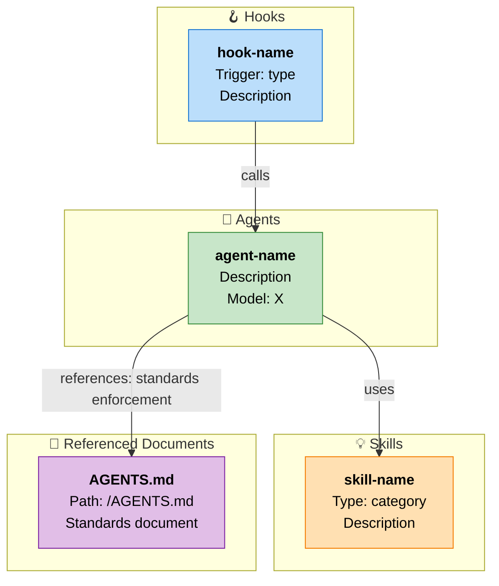

# AI Tools & Automation Documentation Skill

## ⚠️ CRITICAL: GENERIC AND PROJECT-AGNOSTIC DESIGN

**This skill MUST NEVER contain project-specific information or hardcoded references.**

✅ **ALLOWED**:
- Generic file paths like `.kiro/`, `.claude/`, `skills-lock.json`
- Generic decision tree templates based on discovered skills
- Generic workflow descriptions and graph patterns
- Dynamic generation based on discovered entities (skills, hooks, agents, documents)
- Platform-specific logic (Kiro vs Claude) based on user selection

❌ **FORBIDDEN**:
- Hardcoded skill, hook, or agent names
- Project-specific tool references (e.g., "Vite", "React", "npm")
- Hardcoded project names or domains
- Assumptions about which skills/hooks/agents exist
- Implicit entity references (only direct name references)
- Hidden platform assumptions (always ask user which platform)

**Why?** This skill must work identically for ANY project across ANY platforms (Kiro, Claude). All content is dynamically discovered, never hardcoded.

## Overview

This skill discovers all available AI tools, hooks, and agents in your project and generates a comprehensive AI.md file. It creates:

1. **AI Tools Inventory** — All discovered skills organized by type (Custom, Open-source, Agent Skill)
2. **Decision Trees** — Dynamic workflows based on discovered AI tools
3. **Agent Tools Graph** — Mermaid diagram showing hook→agent→skill→document relationships
4. **Document Dependency Map** — All files/documents referenced by AI entities, with usage descriptions

The skill maintains a single source of truth for your project's automation infrastructure and AI tools.

## What This Skill Does

### 1. AI Tools Discovery & Inventory

Discovers AI tools from multiple sources and classifies them into three categories.

#### Classification Rules (Source of Truth)

The classification of skills is determined by a single authoritative source:

**Open-source skills** = Any skill whose name appears as a key in `skills-lock.json`.
- This file is the SOLE source of truth for open-source classification.
- If a skill name exists in `skills-lock.json`, it is open-source — regardless of whether it also has a local copy in `.kiro/skills/` or `.claude/skills/`.
- Many open-source skills have local copies (installed from their repositories). The presence of a local directory does NOT make them custom.
- The `source` field in `skills-lock.json` indicates the GitHub repository origin.

**Custom skills** = Skills found in `.kiro/skills/<name>/SKILL.md` or `.claude/skills/<name>/SKILL.md` whose name does NOT appear in `skills-lock.json`.
- These are project-specific skills created by the team for this project only.
- They have no external repository reference in `skills-lock.json`.

**Agent skills** = Skills from enabled plugins in `.claude/settings.json` (e.g., `enabledPlugins`).
- These come from third-party plugin systems, not from local skill directories.

#### Discovery Order (with deduplication)

1. Parse `skills-lock.json` FIRST → these are all open-source (establishes the open-source name set)
2. Scan `.kiro/skills/` and `.claude/skills/` → only skills NOT in the open-source name set are custom
3. Check `.claude/settings.json` for enabled plugins → these are agent skills

#### Critical Rule: No Skill Appears in Multiple Categories

A skill name appears in exactly ONE section of the output. The priority is:
- `skills-lock.json` presence → Open-source (highest priority)
- Local directory without lock entry → Custom
- Plugin system → Agent Skill

### 2. Dynamic Decision Trees

Analyzes discovered skills to create context-aware decision trees:
- Identifies available skill types (implementation, review, testing, docs, etc.)
- Creates workflows for common scenarios
- Only mentions skills that ACTUALLY exist in the project
- Updates automatically when skills are added/removed

### 3. Agent Tools Graph with Document Dependencies

The graph now includes **four node types** — hooks, agents, skills, AND documents/files that are referenced by those entities. This provides a complete picture of what each AI tool depends on.

#### Why Document Nodes Matter

AI entities (hooks, agents, skills) reference project files to function correctly. For example:
- An agent's system prompt may reference `AGENTS.md` as its standards source
- A hook prompt may reference spec documents for validation rules
- A skill may reference implementation files as sources of truth

If any of these files are moved, deleted, or renamed, the AI tool breaks silently. By including document nodes in the graph, you get:
- **Visibility** into what each AI tool depends on
- **Impact analysis** when renaming or deleting files
- **Broken reference detection** before problems occur in production

#### Graph Node Types

| Node Type | Icon | Color | Purpose |
|-----------|------|-------|---------|
| Hook | 🪝 | Blue (#bbdefb) | Triggers automation |
| Agent | 🤖 | Green (#c8e6c9) | Executes tasks |
| Skill | 💡 | Orange (#ffe0b2) | Provides capabilities |
| Document | 📄 | Purple (#e1bee7) | Referenced file dependency |

#### Edge Types

| Edge | Label | Meaning |
|------|-------|---------|
| Hook → Agent | "calls" or "triggers" | Hook invokes a named agent |
| Agent → Skill | "uses" | Agent activates a skill |
| Hook → Document | "references: [usage]" | Hook prompt depends on this file |
| Agent → Document | "references: [usage]" | Agent system prompt depends on this file |
| Skill → Document | "references: [usage]" | Skill instructions depend on this file |
| Hook → Skill | "activates" | Hook prompt activates a skill directly |

The `[usage]` annotation is a short phrase explaining how the document is used (e.g., "standards enforcement", "type source of truth", "validation spec").

### 4. Reference Validation (Soft with Confirmation)

Every discovered reference is validated against the filesystem. The behavior depends on the reference type:

**Hard references** (must exist — block generation if missing):
- Agent `skills` array entries → the skill must exist in discovered skills
- Hook `invokeSubAgent(name: "X")` patterns → the agent must exist in `.kiro/agents/` or `.claude/agents/`

**Soft references** (warn and ask — mark in output if confirmed missing):
- File paths referenced in prompts, system prompts, or skill documents
- When a soft reference is broken:
  1. Report the broken reference to the caller with context (which entity references it, what path was expected)
  2. Ask the caller to confirm: "Is this reference expected to be missing, or should generation stop so you can fix it?"
  3. If caller confirms it's expected → continue generation, mark the node with ⚠️ warning styling (yellow border) in the graph
  4. If caller says to fix → stop generation, report all broken references

### 5. Deduplication & Cleanup

- `skills-lock.json` is the single source of truth for open-source classification
- Each skill appears exactly once in output (no duplicates across sections)
- Each document node appears once even if referenced by multiple entities (edges show all referencing entities)
- Clean, non-redundant inventory
- No stale references

## Document Reference Discovery

This is the core new capability. The skill extracts file/document references from AI entity configurations.

### What Counts as a "Real Reference"

**IS a real reference** (include in graph):
- File paths in structured reference sections (e.g., "KEY REFERENCE FILES:", "Reference Files:", "Skill guide:")
- Direct filesystem paths starting with `/`, `./`, `.kiro/`, `.claude/`, or `src/`
- Paths in the format `/path/to/file.ext` that point to actual project files
- Skill names in agent `skills` arrays
- Agent names in `invokeSubAgent(name: "X")` patterns
- File paths after keywords like "Read", "Check", "File:", "Source:", "Location:"

**Is NOT a real reference** (exclude from graph):
- Generic command examples (e.g., `npm run test`, `git diff --name-only`)
- File paths in template/placeholder format (using `[brackets]`, `<angle-brackets>`, `{curly-braces}`)
- Hypothetical paths used for illustration in code comments
- URLs (http/https)
- Package names without path separators (e.g., `vitest`, `eslint`)
- Paths that are clearly output destinations (e.g., "Save outputs to:")

### Extraction Patterns

For each AI entity (hook, agent, skill), scan its text content for file references:

**From agent `.agent.json` files**:
- Scan `systemPrompt` field for file paths
- Look for document names like `AGENTS.md`, `README.md`, etc.
- Check `skills` array (validated as skill references, not document references)

**From hook `.kiro.hook` files**:
- Scan `then.prompt` field for file paths
- Look for "KEY REFERENCE FILES" or similar structured sections
- Extract `invokeSubAgent(name: "X")` as agent references
- Extract skill names mentioned with "USE THE X SKILL" patterns

**From skill `SKILL.md` files**:
- Scan the full markdown body for file paths
- Look for reference sections pointing to other files
- Check for `#[[file:...]]` inclusion patterns

### Usage Description Extraction

For each discovered file reference, extract a short description of HOW it's used. Heuristics:
- If the reference appears after "Standards:", "Verify against:", "Check:" → usage is "standards enforcement"
- If it appears after "Source of truth:", "Authoritative source:" → usage is "source of truth"
- If it appears after "Requirements:", "Spec:" → usage is "requirements source"
- If it appears after "Architecture:", "Design:" → usage is "architecture reference"
- If it appears in a section about validation → usage is "validation rules"
- If it appears with "Read", "Scan", "Parse" → usage is "input data"
- If context is unclear → usage is "dependency"

## Platform Selection Workflow

When this skill is invoked:

1. **Ask user**: "Which platform should I document? (Kiro or Claude)"
   - Kiro: Discover from `.kiro/hooks/`, `.kiro/agents/`
   - Claude: Discover from `.claude/hooks/`, `.claude/agents/` (if structured similarly)

2. **Execute platform-specific discovery**:
   - Parse JSON files for the selected platform
   - Extract relationships (hook → agent → skill → document)
   - Build relationship graph

3. **Validate all references** (see Reference Validation section)

4. **Generate AI.md** with all sections

## Discovery Process

### Step 1: Skills Discovery (from skills-lock.json — FIRST)

Parse `skills-lock.json` at the project root.

```json
{
  "version": 1,
  "skills": {
    "skill-name": {
      "source": "github-org/repo-name",
      "sourceType": "github",
      "computedHash": "..."
    }
  }
}
```

- Every key in `skills` object → open-source skill
- Collect ALL into "open-source names" set
- Then scan local dirs, only classify as Custom if NOT in open-source set
- Check `.claude/settings.json` for agent skills

### Step 2: Hook Discovery (Platform-Specific)

**Kiro Platform** (`.kiro/hooks/*.kiro.hook`):
- Parse each JSON file
- Extract: `name`, `when.type`, `then.type`, `then.prompt`
- For `askAgent` hooks:
  - Scan prompt for `invokeSubAgent(name: "agent-name")` → agent reference
  - Scan prompt for `USE THE X SKILL` → skill reference
  - Scan prompt for file paths → document references
  - For each file reference, extract usage context

### Step 3: Agent Discovery (Platform-Specific)

**Kiro Platform** (`.kiro/agents/*.agent.json`):
- Parse each JSON file
- Extract: `name`, `displayName`, `description`, `skills[]`, `systemPrompt`
- For `skills` array → skill references (validate existence)
- Scan `systemPrompt` for file paths → document references
- For each file reference, extract usage context

### Step 4: Document Reference Collection

Aggregate all discovered file references from hooks, agents, and skills:
- Deduplicate by file path (same file referenced by multiple entities → one node, multiple edges)
- For each unique file path:
  - Validate it exists on disk
  - If missing → trigger soft validation workflow (see Reference Validation)
  - Record which entities reference it and how

### Step 5: Graph Construction

Build a directed graph with four node types:
- **Hooks**: name, trigger type, description
- **Agents**: name, displayName, description
- **Skills**: name, type (custom/open-source/agent), description
- **Documents**: file path, short name (filename), usage summary

Edges:
- Hook → Agent (label: "calls" or "triggers")
- Hook → Skill (label: "activates")
- Agent → Skill (label: "uses")
- Hook → Document (label: "references: [usage]")
- Agent → Document (label: "references: [usage]")
- Skill → Document (label: "references: [usage]")

Include isolated nodes (entities with no connections).

### Step 6: Validation

**Hard validation** (error → stop):
- Every skill name in an agent's `skills` array must exist in discovered skills
- Every agent name in `invokeSubAgent(name: "X")` must exist in discovered agents

**Soft validation** (warn → confirm → mark):
- Every file path reference must exist on disk
- If missing:
  1. Collect ALL broken references
  2. Present them to the caller as a list: "These file references are broken: [list with source entity and path]"
  3. Ask: "Should I continue with warnings, or stop so you can fix these?"
  4. If continue → mark broken nodes with ⚠️ warning styling
  5. If stop → halt generation, output the broken reference list

### Step 7: Mermaid Generation

Convert graph to Mermaid TD syntax with four node types:



**Styling rules**:
- Hooks: `fill:#bbdefb,stroke:#1976d2,stroke-width:2px,color:#000`
- Agents: `fill:#c8e6c9,stroke:#388e3c,stroke-width:2px,color:#000`
- Skills: `fill:#ffe0b2,stroke:#f57c00,stroke-width:2px,color:#000`
- Documents (valid): `fill:#e1bee7,stroke:#7b1fa2,stroke-width:2px,color:#000`
- Documents (broken reference ⚠️): `fill:#fff9c4,stroke:#f9a825,stroke-width:3px,stroke-dasharray:5 5,color:#000`

### Step 8: Error Handling

- **Malformed JSON**: Log warning, skip file, continue
- **Broken hard references** (skill/agent not found): Error out immediately with clear message
- **Broken soft references** (file not found): Collect, present to caller, get confirmation
- **Empty project**: Generate empty sections with explanatory notes
- **Circular dependencies**: Detect and note in output

## AI.md Output Structure

```markdown
# Available AI Tools

[introductory text]

## 🛠️ Custom Skills
| Skill | Type | Description | Source |
...

## 📦 Open-source Skills
| Skill | Type | Description | Source |
...

## 🤖 Agent Skills
| Skill | Type | Description | Source |
...

## 🎯 Decision Trees
[dynamic workflows based on discovered skills]

## 🔗 Agent Tools Graph
### Graph Legend
- 🪝 Hook (Blue) — Triggers automation
- 🤖 Agent (Green) — Executes tasks
- 💡 Skill (Orange) — Provides capabilities
- 📄 Document (Purple) — Referenced file dependency
- ⚠️ Broken Reference (Yellow dashed) — File not found on disk
- Edge labels: "calls", "triggers", "uses", "activates", "references: [usage]"

[Mermaid diagram]

### Document Dependencies
| Document | Referenced By | Usage |
| --- | --- | --- |
| AGENTS.md | code-review-agent, post-task-code-review-agent | Standards enforcement |
| ...

### Active Workflows
[workflow descriptions]

### Broken References (if any)
⚠️ The following references could not be resolved:
| Source Entity | Referenced Path | Expected Usage |
| --- | --- | --- |
| ... | ... | ... |

## 📋 Summary
[counts and metrics]
```

## When to Use

- **After adding new skills**: Update AI.md with new discoveries
- **After adding hooks or agents**: Visualize new automation workflows
- **After moving/renaming files**: Detect broken references in AI tools
- **Before releases**: Verify all AI tool dependencies are intact
- **During audits**: Understand project automation infrastructure
- **Onboarding**: Generate reference docs for new team members
- **Troubleshooting**: Visualize hook→agent→skill→document chains
- **Architecture review**: See automation dependencies at a glance
- **Refactoring**: Understand which AI tools break if you move a file

**Note**: AI.md is always **completely regenerated from scratch**. No stale data persists across runs.

## Success Criteria

✅ AI.md generated with all sections
✅ Skills inventory accurate and complete
✅ Decision trees dynamic and based on discovered skills
✅ Agent Tools Graph includes all four node types (hook, agent, skill, document)
✅ Document nodes show all files referenced by AI entities
✅ Edge labels include usage descriptions for document references
✅ Document nodes styled in purple
✅ Broken references detected and reported to caller
✅ Broken references marked with warning styling (yellow dashed border) if caller confirms continue
✅ Hard references (skill/agent existence) validated strictly
✅ Graph includes isolated nodes
✅ Mermaid syntax valid and renders correctly
✅ Both Kiro and Claude platforms supported
✅ Error handling for malformed files
✅ No stale data in output
✅ Document Dependencies table in output
✅ All real file references extracted (not examples/templates)

## Key Characteristics

- **Dynamic, never hardcoded** — Discovers all relationships from actual files
- **Platform-aware** — User chooses which platform to document
- **Regenerated completely** — No stale data persists
- **Comprehensive** — Includes all entity types, relationships, AND file dependencies
- **Validated** — Broken references caught before they cause runtime failures
- **Visual** — Mermaid graph shows full automation infrastructure clearly
- **Reusable** — Works across different projects and architectures

## Reference Files

For detailed implementation guidance, read:
- `TOOLS_GRAPH_IMPLEMENTATION_GUIDE.md` — Pseudocode and architecture for graph construction
